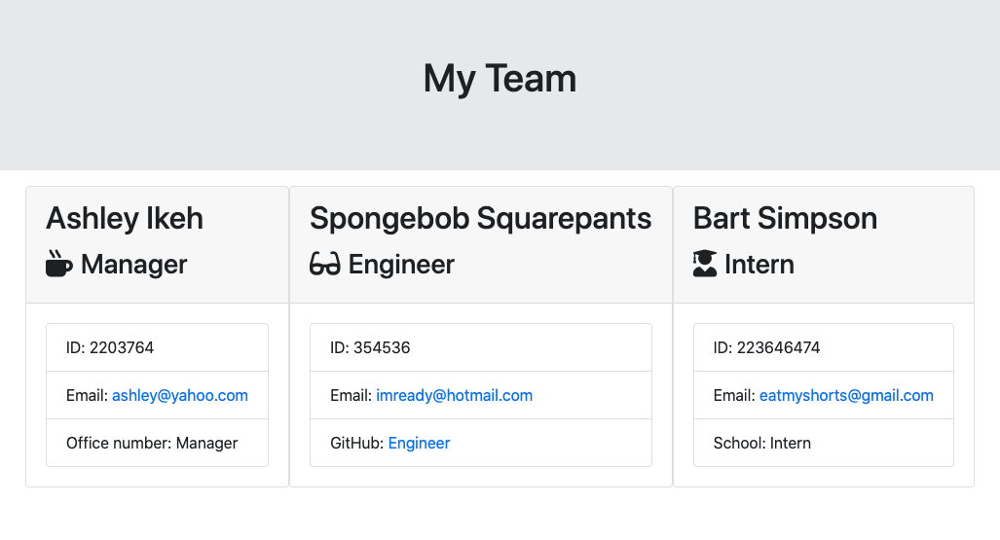

 
# Employee Summary Generator

## Contents
* [Installation](installation)
* [Usage](usage)
* [License](license)
* [Credits](credits)

## A Quick And Easy Employee Archive

Are you a company manager looking for an easy way to showcase the employees at your business? Well look no further, the Employee Summary Generator is an app that allows you to input basic, but necessary, information about each of your employees and serves them up on a web page that is easy to read! This application takes away the time consuming work of creating a website by allowing you to just put in the information and have a finished product made for you. If only remembering your subordinates' names were this easy!
Read the installation instructions below to get started.

## Installation

To view the github repository for this application [click here](https://github.com/Aikeh2021/Employee-Summary-Generator). Otherwise, [click here](https://drive.google.com/file/d/14AEIh2H-fXricya0zidnEcUirDeQpVCF/view) to view a video demonstrating the functionality of this app.

## Usage

To use this app, use your terminal to navigate to the directory underwhich the repository has been stored. Type the command 'node app.js' into the command line. This will begin a series of prompts. Answer each response with the knowledge you have of your employees. As manager, don't forget that you are also included as an employee of the company. This way if the site is viewed by new employees, they have information on you as well.
After you have entered in all of the information for your desired employees, tell the command line that you no longer wish to add more employees. Once the computer receives this input, your team website will be generated and store in the output directory.  

## License

MIT License

Copyright © 2020 Ashley Ikeh

Permission is hereby granted, free of charge, to any person obtaining a copy
of this software and associated documentation files (the "Software"), to deal
in the Software without restriction, including without limitation the rights
to use, copy, modify, merge, publish, distribute, sublicense, and/or sell
copies of the Software, and to permit persons to whom the Software is
furnished to do so, subject to the following conditions:

The above copyright notice and this permission notice shall be included in all
copies or substantial portions of the Software.

THE SOFTWARE IS PROVIDED "AS IS", WITHOUT WARRANTY OF ANY KIND, EXPRESS OR
IMPLIED, INCLUDING BUT NOT LIMITED TO THE WARRANTIES OF MERCHANTABILITY,
FITNESS FOR A PARTICULAR PURPOSE AND NONINFRINGEMENT. IN NO EVENT SHALL THE
AUTHORS OR COPYRIGHT HOLDERS BE LIABLE FOR ANY CLAIM, DAMAGES OR OTHER
LIABILITY, WHETHER IN AN ACTION OF CONTRACT, TORT OR OTHERWISE, ARISING FROM,
OUT OF OR IN CONNECTION WITH THE SOFTWARE OR THE USE OR OTHER DEALINGS IN THE
SOFTWARE.

## Credits

* [Using super](https://www.w3schools.com/jsref/jsref_class_super.asp)
* [Making Complex Inquirer.Prompts](https://www.digitalocean.com/community/tutorials/nodejs-interactive-command-line-prompts#multiple-prompts)
* [List Type in Inquirer.Prompt](https://medium.com/javascript-in-plain-english/how-to-inquirer-js-c10a4e05ef1f)
* [Merging Javascript Objects](https://www.javascripttutorial.net/object/javascript-merge-objects/) 
* [fs.writeFile Method](https://www.geeksforgeeks.org/node-js-fs-writefile-method/)
* [Markdown License Badges](https://gist.github.com/lukas-h/2a5d00690736b4c3a7ba)